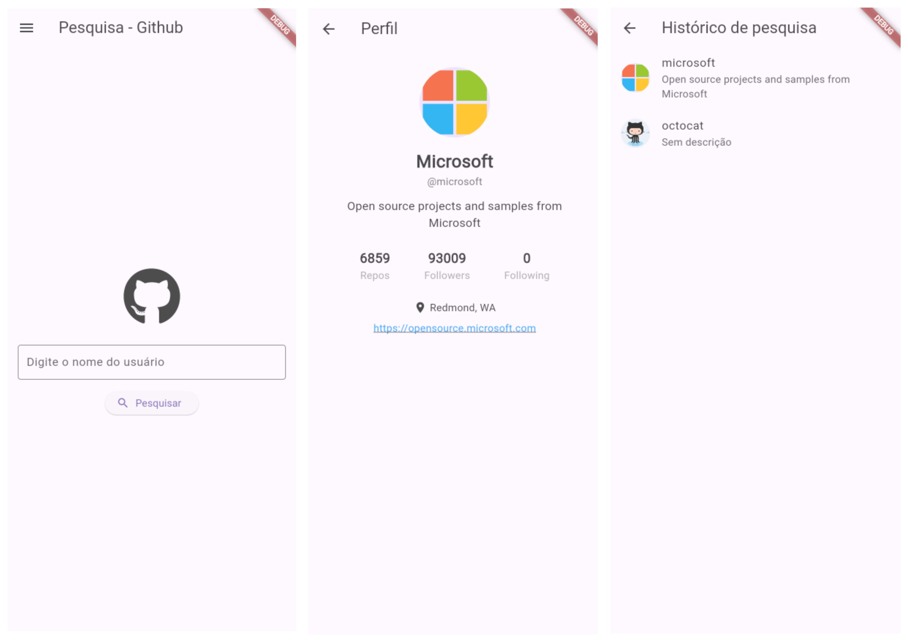

# 🚀 GitHub Profile App  

O GitHub Profile App é um aplicativo Flutter que permite pesquisar usuários do GitHub e visualizar informações detalhadas do perfil, como nome, avatar, bio e muito mais! Ele também mantém um histórico das pesquisas realizadas.

## ✨ Funcionalidades

- 🔍 **Pesquisa de Usuários:** Digite o nome de usuário do GitHub e veja os detalhes do perfil em segundos.
- 📝 **Histórico de Pesquisas:** Consulte rapidamente os usuários pesquisados anteriormente.
- 👤 **Detalhes do Perfil:** Veja avatar, nome, login e bio do usuário.
- 🎨 **Interface Moderna:** Visual agradável e responsivo, com uso de ícones FontAwesome.

---

## 📱 Capturas de Tela  
  

## 🛠️ Tecnologias Utilizadas

- **Flutter:** SDK para desenvolvimento de aplicativos móveis.

## 📄 Licença

Este projeto está licenciado sob a Licença MIT - veja o arquivo [LICENSE](LICENSE) para detalhes.
